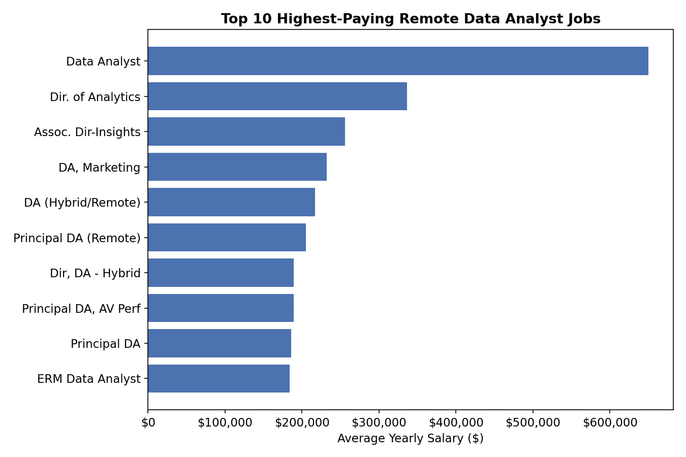
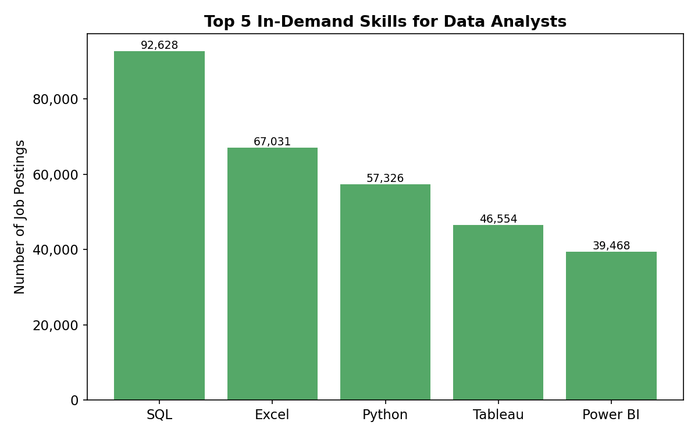
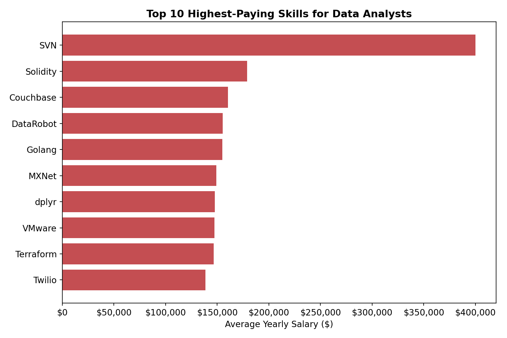
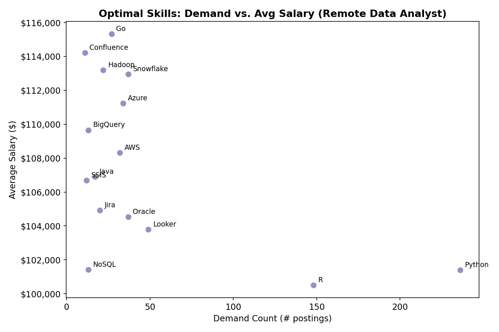

# Introduction
Dive into the data job market! Focusing on Data Analyst roles, this project explores top-paying jobs,  in-demand skills, and where high demand meets high salary in data analytics.

Check out the SQL queries here: [project_sql folder](/project_sql/)

# Background
This project was driven by a desire to navigate the data analyst job market more effectively by pinpointing top-paid and in-demand skills, streamlining others' work to find optimal jobs.

The data comes from a job postings dataset containing details on job titles, salaries, locations, and required skills.

### The questions I wanted to answer through my SQL queries were:

1. What are the top-paying data analyst jobs?
2. What skills are required for these top-paying jobs?
3. What skills are most in demand for data analysts?
4. Which skills are associated with higher salaries?
5. What are the most optimal skills to learn?

# Tools I Used
For my deep dive into the data analyst job market, I harnessed the power of several key tools:

- **SQL**: The backbone of my analysis, allowing me to query the database and unearth critical insights.
- **PostgreSQL**: The chosen database management system, ideal for handling the job posting data.
- **Visual Studio Code**: My go-to for database management and executing SQL queries.
- **Git & GitHub**: Essential for version control and sharing my SQL scripts and analysis, ensuring collaboration and project tracking.

# The Analysis
Each query for this project aimed at investigating specific aspects of the data analyst job market. Here's how I approached each question:

### 1. Top Paying Data Analyst Jobs
To identify the highest-paying roles, I filtered Data Analyst positions by average yearly salary and location, focusing on remote jobs.

🔗 [View SQL query](/project_sql/1_top_paying_jobs.sql)

*Bar graph visualizing the salary for the top 10 highest-paying remote Data Analyst jobs.*

### 2. Skills for Top Paying Jobs
To understand what skills are required for the highest-paying jobs, I joined the top-paying jobs from the previous query with the skills data.

🔗 [View SQL query](/project_sql/2_top_paying_job_skills.sql)

### 3. In-Demand Skills for Data Analysts
This query helped identify the skills most frequently requested in job postings, directing focus to areas with high demand.

🔗 [View SQL query](/project_sql/3_top_demanded_skills.sql)

*Bar graph visualizing the top 5 most in-demand skills for Data Analyst job postings.*

### 4. Skills Based on Salary
Exploring the average salaries associated with different skills revealed which skills are the highest paying.

🔗 [View SQL query](/project_sql/4_top_paying_skills.sql)

*Bar graph visualizing the top 10 highest-paying skills for Data Analysts. Note these are niche skills tied to only a handful of postings each, so treat them as outliers rather than a primary skill-building strategy.*

### 5. Most Optimal Skills to Learn
Combining insights from demand and salary data, this query aimed to pinpoint skills that are both in high demand and have high salaries, offering a strategic focus for skill development.

🔗 [View SQL query](/project_sql/5_optimal_skills.sql)

*Scatter plot visualizing demand vs. average salary for skills in remote Data Analyst postings. Python and R sit far right with high demand and solid pay, while Snowflake, Azure, and AWS offer the best balance of strong demand and above-average salary.*

# What I Learned
Throughout this project, I strengthened several core SQL skills and techniques:

-  **Complex Query Building**: Learned to construct multi-table queries using JOINs and CTEs (Common Table Expressions) to break analysis into logical, readable steps.
- **Data Aggregation**: Got comfortable with `GROUP BY`, along with aggregate functions like `COUNT()` and `AVG()`, to summarize data effectively.
- **Analytical Thinking**: Improved my ability to translate real-world questions into actionable SQL queries, and to interpret the resulting data into meaningful insights.

# Conclusions

### Insights
From the analysis, several general insights emerged:

1. **Top-Paying Data Analyst Jobs**: The highest-paying remote Data Analyst roles offer a wide salary range, with some postings reaching well above six figures showing significant earning potential in the field.
2. **Skills for Top-Paying Jobs**: High-paying roles consistently require strong SQL skills, reinforcing SQL as a critical skill for landing top-tier salaries.
3. **Most In-Demand Skills**: SQL also leads in overall demand across Data Analyst postings, making it the most essential skill for job seekers to prioritize.
4. **Skills with Higher Salaries**: Specialized and niche skills tend to command higher average salaries, indicating a premium on more technical or less common expertise.
5. **Optimal Skills for Job Market Value**: Skills that balance high demand with high average salary like SQL represent the most strategic skills for maximizing career opportunities.

### Closing Thoughts
This project enhanced my SQL skills and provided valuable insights into the data analyst job market. The findings from the analysis serve as a guide to prioritizing skill development and job search efforts. Aspiring data analysts can better position themselves in a competitive job market by focusing on skills that are both in high demand and associated with high salaries. This exploration highlights the importance of continuous learning and adaptation to emerging trends in the field of data analytics.